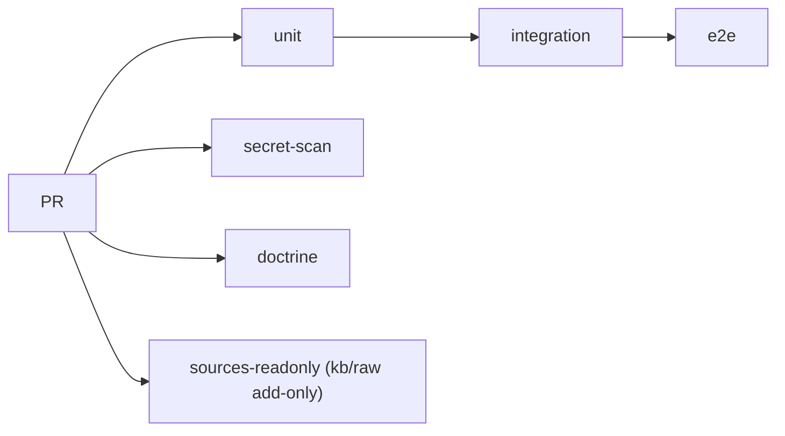

# 01 — Service Architecture

## What

The template repo provides a minimal Python HTTP service behind Docker Compose with a three-tier test suite (unit, integration, E2E) and two GitHub Actions workflows. It demonstrates the agentic development workflow from AGENTS.md.

## Why

- New agent-driven projects need a working skeleton that enforces the doctrine from day one, not a blank repo.
- A real service with real tests proves the pipeline works before any custom code is added.
- Each tier named in AGENTS.md §5 must have a runner and a CI job, or the doctrine is decorative — the skeleton is where that is proven.
- The doc structure itself models the `coding-agents-docs-guideline` template so agents learn by example.

## How

The service lives in `service/`. It is a Python stdlib HTTP server with three endpoints:

| Endpoint | Method | Response | Purpose |
|----------|--------|----------|---------|
| `/health` | GET | `{"status":"ok"}` | Docker healthcheck + readiness probe |
| `/` | GET | `{"message":"hello"}` | Root endpoint |
| anything else | GET | `{"error":"not found"}` | 404 catch-all |

Routing is a pure function, `route(path) -> (code, body)`. `Handler.do_GET` is a two-line adapter over it. The split is what makes a genuine unit tier possible: the unit tests call `route()` with no socket, and the transport is left to the integration and E2E tiers.

### Container image

```dockerfile
FROM python:3.12-slim
WORKDIR /app
COPY . .
EXPOSE 8000
CMD ["python", "-m", "src.main"]
```

The image is built from `service/` — the build context is the service directory, so `src/main.py` becomes `src.main` inside the container. The image carries no test dependencies: every tier runs outside the container (`tests/unit`, `tests/integration`) or against it (`tests/e2e`).

### Docker Compose

```yaml
services:
  service:
    build: ./service
    healthcheck:
      test: ["CMD", "python", "-c", "import urllib.request; urllib.request.urlopen('http://localhost:8000/health')"]
      interval: 5s
      timeout: 3s
      retries: 5
```

No host port binding. The service is only reachable inside the Docker network. E2E tests use `docker compose exec` to reach the container directly. For direct host access in development, merge the tracked override explicitly:

```bash
docker compose -f docker-compose.yml -f docker-compose.host-ports.example.yml up -d
```

### Test tiers

| Tier | Location | Runner | CI job | Coverage |
|------|----------|--------|--------|----------|
| Unit | `tests/unit/test_routing.py` | pytest | `unit` | `route()` path mapping (AC-EXM-001..003) |
| Integration | `tests/integration/test_service_endpoints.py` | pytest | `integration` | The service out of process over a real socket (AC-EXM-201..203) |
| E2E | `tests/e2e/example.bats` | bats | `e2e` | The running container via `docker compose exec` (AC-EXM-101..102) |

The hundreds digit of the test ID names the tier (AGENTS.md §5). `tests/conftest.py` puts `service/` on `sys.path`; `tests/requirements.txt` holds the test-only dependencies.

`tests/run.sh` runs tier 1 and tier 2 unconditionally and tier 3 only with `--with-e2e`, so the default invocation needs no running container. It accumulates failures across tiers rather than exiting at the first, and prints `RESULT: PASSED` or `RESULT: FAILED`.

### CI pipeline

```yaml
# .github/workflows/ci.yml
jobs:
  unit:          # pytest tests/unit
    needs: []
  integration:   # pytest tests/integration
    needs: [unit]
  e2e:           # docker compose up + bats
    needs: [integration]
  secret-scan:   # tracked credential files + hardcoded assignments
    needs: []
  doctrine:      # entry-point symlinks resolve; the funnel is tracked
    needs: []
```

`sources-readonly.yml` is the second gate: it fails any PR that modifies or deletes a file under `kb/raw/**` without the `ingest` label, making funnel rule 3 structural rather than advisory.

The same chain as a diagram (AGENTS.md §7 — render the structure, don't describe it in prose):



## Verification

```bash
# Build and start
docker compose up -d --build

# Verify container health
docker compose ps --format '{{.Name}} {{.Status}}'

# Run all three tiers
bash tests/run.sh --with-e2e
```

`docker compose ps` must report `(healthy)`. The runner must print `7 passed` for unit, `3 passed` for integration, `ok 1`/`ok 2` for bats, and end with `RESULT: PASSED`.

## What Works

- Docker image builds from `service/` and reports `(healthy)` within 8 seconds of `docker compose up -d --build`
- All fourteen tests pass locally: 9 unit + 3 integration + 2 bats
- Every tier has both a runner in `tests/run.sh` and a job in `ci.yml` — no tier is a stub
- `bash tests/run.sh` with no flags passes without Docker running, and reports the E2E tier as skipped rather than failed
- The integration fixture polls `/health` (0.1s interval, 5s budget) instead of sleeping a flat second — the tier completes in ~0.2s and tolerates slow cold starts
- `bash tests/run.sh --with-e2e` starts the compose stack itself when it is down (verified: `docker compose stop service` then a green `--with-e2e` run)
- `docker-compose.host-ports.example.yml` ships the opt-in host-port remedy as a tracked, documented override (`docker compose -f … -f … config` parses)
- `act push -j secret-scan` and `act push -j unit` verified green under real act on this host (runner image `catthehacker/ubuntu` pulled, jobs succeeded)
- The runtime image carries no test dependencies
- CI gates E2E behind unit and integration; `secret-scan` and `doctrine` run independently

## What Fails

- **E2E under `act`:** `act push` unqualified, or `act push -j e2e`, runs `docker compose up -d --build` against the host daemon under this repo's compose project name — on a host running this project live, that replaces the running containers. This is a permanent design constraint (AGENTS.md §6), not a defect: the guard is the documented rule plus the `act`-exercisable jobs being run qualified.

## Resolution

- **E2E under `act`:** Run the act-exercisable jobs qualified — `act push -j unit`, `-j integration`, `-j secret-scan`, `-j doctrine` — and exercise the E2E tier directly (AGENTS.md §6). The base `docker-compose.yml` keeps no host port; when direct host access is needed, merge the tracked override `docker-compose.host-ports.example.yml` explicitly.

## Verdict

**works** — The skeleton verifies end to end: three executable test tiers (14 tests green, cold-start-tolerant, e2e self-starting), five CI jobs (two of them exercised under real act), the kb/raw gate, and an opt-in host-port override. The one permanent caveat is operational, not functional: never run `act push` unqualified on a host serving this compose project (AGENTS.md §6).
